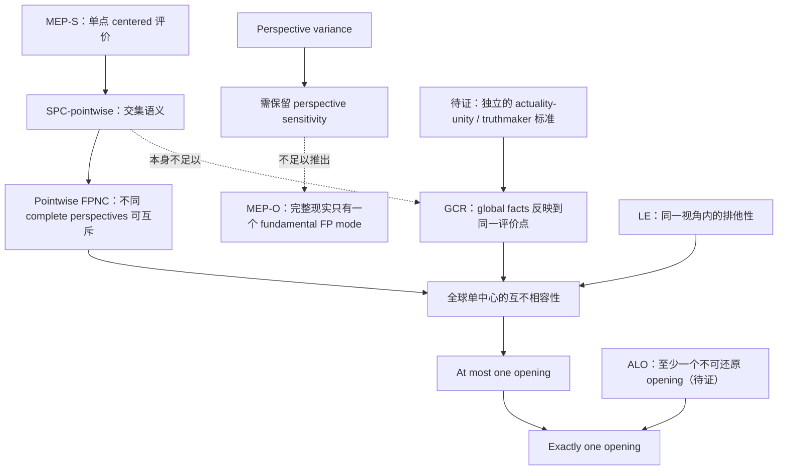
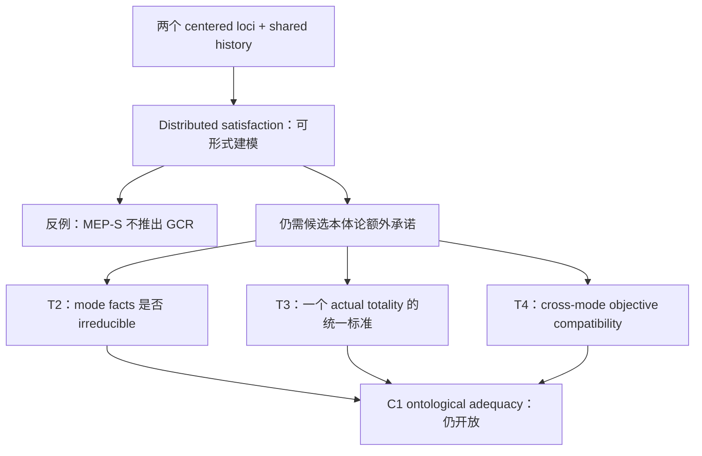
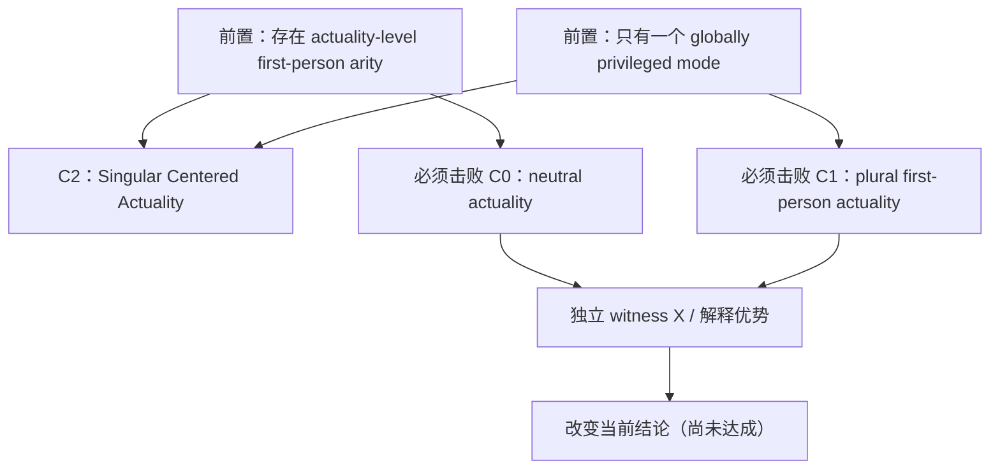

# 论证依赖图 · 2026-10-08

> **用途**：把“逻辑推导”“形式语义模型”“本体论假设”“证据竞争”分别标出，避免旧笔记将后者误写成已获得的定理。  
> 权威判断：[current-position](../synthesis/current-position.md)；全量文件初审：[REVIEW](REVIEW-2026-10-08.md)。

## 1. 总理论空间

| 竞争理论 | 需要增加的不可还原承诺 | 目前最强模型 | 目前最大缺口 |
| --- | --- | --- | --- |
| **C0** | 无须 actuality-level FP mode；允许 ordinary consciousness | [Neutral Actuality Core](models/neutral-actuality-core.md) | 迄今无 neutral incoherence / 独立 FP arity witness |
| **C1** | 多个 ontic first-person obtaining modes + one actual totality | [Plural Opening Manifold](models/plural-opening-manifold.md) | mode irreducibility、MPGC compatibility、global unity |
| **C2** | 一份 reality 的唯一 global opening role / I–NOW orientation | [Role-First Opening](models/role-first-absolute-opening.md) | 必须排除 C0 和 C1；独立 unique privilege witness 尚无 |

“在一个模型内给定原始项”与“该项不可替换且真实存在”是不同证明任务。

## 2. 从第一人称评价到全球唯一性

**箭头类型**：

- 实线：在节点写明的定义/额外前提下可做的条件性推导；不代表该前提为真。
- 虚线：无法凭源节点独立证明目标；这是需要被修补的**缺口**，不是已经存在的蕴涵。
- **MEP-O** 已把 one-mode cardinality 写进本体论断言；若直接采用，只能是 C2 的前提，不能重复计算为 C2 的独立证明。

最容易混淆的三步：

1. \(MEP\text{-}S\) 给一个中心的评价点（**语义**）。
2. \(\varphi_a\land\varphi_b\) 在一个评价点无解（**pointwise**）。
3. 整个现实无法具有两个 genuine openings（**本体论**）。

第 2 到第 3 步需要 **GCR 与关于跨中心互斥事实的附加条件**。参考 [Pointwise–Polycentric](arguments/pointwise-polycentric-reflection-audit.md)、[SPC](arguments/perspective-closure-principle.md)、[USL](arguments/unitary-singularity-lemma.md)。

## 3. C1 反模型审计链

**形式反模型的强度**：在给定语义/结构公理下，通过 pointwise non-compossibility 与 distributed satisfaction 的联合构造；它没有自动建立不可还原性或所有完整性条件。

| 必要验证 | 当前状态 | 主要依据 |
| --- | --- | --- |
| 单点评价不蕴涵全球单中心 | **已有明确有限形式反例** | [MEP-S/GCR 审计](arguments/pointwise-polycentric-reflection-audit.md) |
| mode essentiality ⇒ ontic non-reduction | **没有独立证明**；定义或 primitive | [Plural Model](models/plural-opening-manifold.md) |
| shared history + one A ⇒ metaphysical one-actuality unity | **没有独立完成** | [Pointwise Audit](arguments/pointwise-polycentric-reflection-audit.md) |
| 每个 \(F_i\cup W\) 分别一致 ⇒ 全体一致 | **一般不成立**；需要额外 compatibility | [Pointwise Audit](arguments/pointwise-polycentric-reflection-audit.md) |
| C1 在 List 的论域中应如何分类 | **作为 one-world fragmentalist/pluralist horn 仍可研究** | [FPNC Audit](arguments/first-person-non-compossibility-audit.md) |

## 4. C2 完成条件与证据依赖

支持 C2 的 datum \(X\) 应满足

\[
Independent(X)\land NaturalFit(C2,X)
\land\neg CheapNonSingularAccommodation(X).
\]

目前并无通过全部环节的 \(X\)。[Non-Singular Accommodation Test](arguments/neutral-accommodation-test.md) 给判别规则；[Completion Underdetermination](arguments/completion-underdetermination-result.md) 和 [Primitive Replacement](arguments/primitive-actuality-replacement-test.md) 是旧审计结果。

## 5. 已归入条件或下游的依赖簇

| 问题簇 | 条件或前置门槛 | 当前定位 |
| --- | --- | --- |
| Subject unity → global subject | 强 unity / subject-individuation theory；不能凭多个 local modes 自动得到 | [Global Unity](arguments/global-experiential-unity-audit.md)；[Bearer Discrimination](arguments/bearer-discrimination-principle.md) |
| Global subject → privileged local event | 需要独立 localization / privilege principle | [Global Subject Localization](arguments/global-subject-localization-quadrilemma.md) |
| Presence / NOW → absolute I–NOW | 需要本体的 PresenceSimpliciter 及其 singularity | [Presence Closure](arguments/presence-route-four-way-closure.md) |
| Symmetry / unique structural point → privilege | symmetry constraints 仅约束 non-haecceitistic structural selector | [No Natural Pointing](arguments/no-natural-pointing-theorem.md) |
| Stochastic / process → absolute center | 需要额外 privilege bridge 和时间结构 | [Stochastic Law](arguments/stochastic-absolute-orientation-law.md) |
| C2 → Selective Local vs Universal-I → trajectory | C2 上游尚未确立；不可反向用下游精致程度证明它 | [Locality](arguments/locality-from-subject-unity.md) |

## 5.1. 2026-10-08 的补充推导与模型检验

[进一步 GCR 审计](arguments/gcr-unity-principle-audit.md) 已给：

\[
OCC+SEP+GCR_2\Rightarrow AtMostOne,\qquad
AtMostOne+ALO\Rightarrow ExactlyOne.
\]

还确认 \(GCR_2\not\Rightarrow GCR_{All}\)：pairwise supports 可以两两相交却全体交集为空。共享 history、因果互动、甚至单一共同 truthmaker 也需要额外条件才能产生 GCR。

[C1 跨模式审计](models/mode-amalgamation-neutral-reduct.md) 则明确：

- **固定 objective assignment + 各 private vocabularies 可联合延拓 + 无冲突跨模式约束** ⇒ 形式 SAT；
- **各局部分别 SAT** ⇏ **全局 SAT**（共享 objective variable 或跨模式规则可冲突）；
- neutral projection \(N_0\) 不可恢复 local values；enriched \(N_+\) 可以编码 local values。两者都不足以给出 ontic non-reducibility / reduction theorem。

[代码](../tools/model_audit.py) 和 [回归测试](../tests/test_model_audit.py) 固定这些**有限的形式实例**，不能替代哲学论证。

## 5.2. U3/U4 的新依赖与 C1 的 neutral baseline

\[
GlobalCoConsciousCover
\xrightarrow{+MI,\;realization} OneMode
\xrightarrow{+Reflection} GCR,
\]

其中第一箭头是显式条件证明；第二箭头仍属假说，可能需要额外的 centered truthmaking 条件。一个 global mode 本身也没有保证 singular privileged local I–NOW。

\[
OneUltimateActualizer
\xrightarrow{+AIM} OneMode,
\]

AIM（同一实际化源头只产生同一第一人称模式）尚未获得非循环论证。纯粹 \(\forall F\exists\pi\) 不蕴涵 \(\exists\pi\forall F\)。

C1 / C0 比较新增强中立基底 **B1**（共享客观历史 + 所有主体的 local phenomenality、心理物理关系）；只有在清楚指定 metaphysical possibility class 与 fact identity / grounding 后，才能评价 B1 是否使 C1 的 modes 可还原。有限非决定性结果不等于形而上学独立性证明。

参见 [U3](arguments/co-conscious-unity-to-mode-audit.md)、[U4](arguments/actuality-quantifier-scope-audit.md)、[B1 grounding](models/neutral-contrast-grounding-audit.md) 与 [可执行模型](../tools/model_audit.py)。

## 5.3. 补充：MI/AIM 的关系方向与重叠模式

此前把 mode(e) 当作单值函数，预排除了一个 episode 在多个模式中实现的可能性。一般模型应使用 B⊆E×M。

- MI-Share：co-conscious 的两经验**共享至少一个 mode**；global Cover + MI-Share 并不蕴涵唯一模式。
- MI-Excl：两经验 realized 的**所有 modes 都同一**；Cover + mode realization + nonempty 才条件性给唯一性。
- 唯一 actualizer 只保证 source 数目为一；还需 AIM-Functionality（每个 source 最多一个 mode output）与 modes fully sourced 才得到至多一个 mode。反向「每个 mode 只依赖一个 source」不够。

[正式反例、条件性定理、文献审计](arguments/mi-aim-incidence-audit.md)；[C0/C1/C2 定性成本比较](models/endgame-theory-matrix.md)。

## 5.4. 本轮主轴：解释剩余的类型检查

[Explanatory Residue Audit](arguments/b1-explanatory-residue-audit.md) 区分 B1 **描述完备 D**、局部 consciousness 的 **grounding G** 与 **绝对中心 A**。D 的成立不能证明 G；G 的困难不自动推出 A。若使用 Conitzer 的外部 renderer，必须说明它相对的是 simulation-internal \(\mathcal B\) 还是 complete actual \(\mathcal B_1\)。

研究判别顺序：

1. 确认不含 \(\Omega\) 同义词的 independent \(X\) / 真实 constitution failure；
2. 在最强 C0 B1 中证明其缺口，且给出 C0 合理 grounding 回复；
3. 重新检查 C1 能否采用多个 ontic modes 解释；
4. 才可判断 singular C2 的独有解释收益与新增成本。

Mary 的 phenomenal knowledge gap、普通 de se uncertainty 与 absolute global winner 的差别尤其重要。当前没有已经验证的 C2-exclusive witness。

## 5.5. B1 的 I / F / Q 具体 constitution 及对手对称责任

此前 C0 强中立 B1 仅是 world-side 实际事实的 inventory；现在明确了三种具体可攻击的候选：[I/F/Q 模型](models/c0-phenomenal-constitution-packages.md)与[对手公平测试](arguments/b1-grounding-adversarial-test.md)。

- I：\(P_i\equiv N_i\) 为**需独立辩护的身份同一主张**，不能由记号证明；
- F：\(P_i\) 是 fundamental local phenomenal world fact；完整 **coverage**、明确 **grounding stop**，不能被描述为更深奠基已经成功；
- Q：\(Q_i + Organization_i+ L_Q\Rightarrow_G P_i\) 为待证构成关系，组合、体验性质和主体边界尚有债务。

**双向 explanatory burden**：如果 C1/C2 指责某 C0 方案未 ground local \(P_i\)，则增加 mode 或 singleton 后仍须解释同一个 \(P_i\)。C2 的 \(\Omega^*\) 额外存在不自动解释其余全部主体的痛感，也没有从 C0 的解释不完整性直接推出 GCR。

高收益下一步是 **挑战 C0-F 的 bearer-indexed phenomenal fact 是否本体充足**，成功时先压力测试 C1，随后再处理 C2 exact-one。

## 5.6. C0-F 的事件身份反方检查

[Taylor–Guillot 审计](arguments/c0-f-subject-experience-identity-gate.md) 将局部真实体验构造成 s 于 t 实例化真正现象性质 q 的事件。选定 PE 的 identity condition 时，体验 token 的本质主体归属得到一种具体本体解释。**每个 event 有自己的 bearer** 不推出 **所有 events 有同一 global bearer**。

仍欠：为何 q 真正 phenomenally felt、PE 单 bearer 设定能否容纳 Roelofs 的共享体验、C1 为何还需独立 obtaining mode。Guillot 区分 for-me-ness、me-ness、mineness，前者不自动给后两者，更不能给全局中心。参见[文献](../literature/subject-experience-givenness-dossier.md)与[有限模型](../tools/model_audit.py)。

## 6. 开放依赖关口与停止条件

| ID | 目标 | 不能当作证明的替代品 |
| --- | --- | --- |
| **G1** | 独立辩护 MI-Excl 与 AIM-Functionality；弱 MI-Share/反向 source 唯一性都不够 | centered-world 交集的重新书写 |
| **G2** | 相对于包含 local phenomenality 的 B1，验证 mode fact identity、admissible worlds 与 grounding | 单纯把 mode 设为 primitive |
| **G3** | MPGC 的 shared facts 与 cross-mode 逻辑规范 | 两个 local sets 各自 consistent |
| **G4** | C0/C1/C2 同尺度 explanatory comparison | 单纯原始符号的数量、旧论文/论证的数量 |
| **G5** | 找到能抵抗 C0 与 C1 的新 witness | 现象学强烈感受或“为什么是我”的疑问本身 |

**更新的默认顺序**：先审 B1 的 local phenomenal grounding 与独立 residual（G2/G5），若发现足以改变解释成本的 datum 再重启 MI/AIM/GCR（G1）及 C1 MPGC（G3）；G4 持续同尺度对照。没有可复核的新证据或原则，不宣称 C2 已得证。
